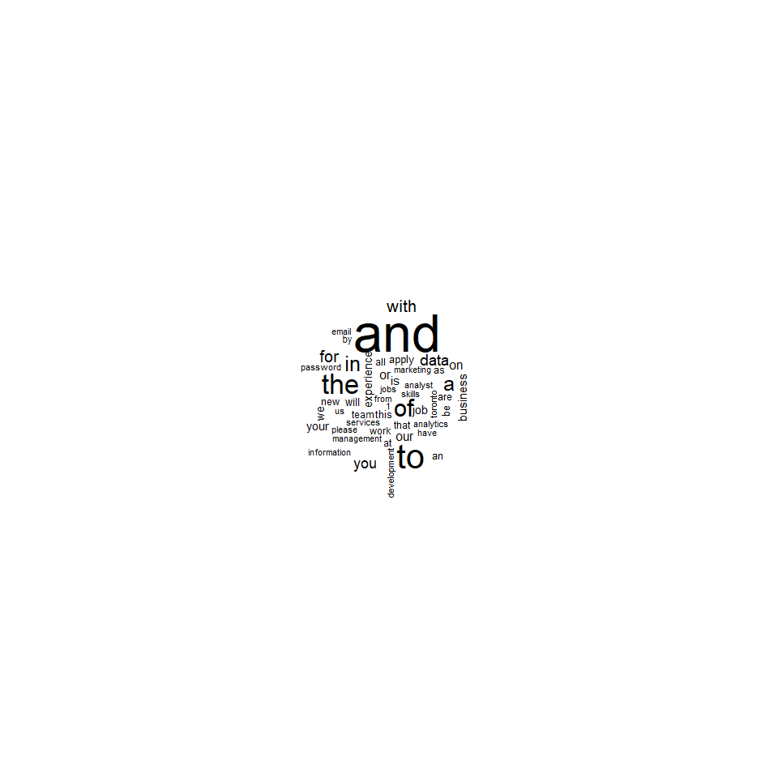

-   This document was rendered last on 2017-10-12

*THIS PROJECT IS STILL UNDER CONSTRUCTION*
------------------------------------------

The intention will be to mask the code as the project approaches completion.

Executive Summary
-----------------

-   This project was produced for the Text Analytics Workshop for the Winter 2018 Masters of Management Analytics Cohort at Queen's University
-   The goal from the outset was to use text analytics techniques developed in class to examine jobs companies have posted on Indeed in Toronto and employ techniques discussed in class including document clustering, topic modelling, and visualization.

Project Rationale
-----------------

-   A open sourced project working with real world data was desired
-   Other projects can be found scraping DS/Analytics jobs from Indeed. Typically word frequencies for keywords like Python or Hadoop are calculated
-   Moving beyond that, we were interested in topic modelling and how the choice of words signals relationships between roles
-   Job postings fit the 'bag of words' or ngram approach taught in class. Not many employers say **"We don't want someone who knows Python"**

``` r
library(feather)
library(tidyverse)
library(tidytext)
library(tm)
library(wordcloud)
library(widyr)
library(ggraph)
library(igraph)
library(knitr)
library(ggridges)
```

Gathering Data
--------------

-   Beautiful Soup & Selenium were used in Python to access [Indeed](https://www.indeed.ca/jobs?q=analytics&l=Toronto&start=10 "Indeed:Analytics Jobs in Toronto") and scrape unsponsored job titles, companies, and postings
-   `later number` unique jobs were scraped from the search terms: `analytics`,`etc`....
-   Jobs were passed from Python to R using [Feather](https://blog.rstudio.com/2016/03/29/feather/ "Feather: A Fast On-Disk Format for Data Frames for R and Python, powered by Apache Arrow")

``` r
rm(list=ls())
#list our data files
searches <- c("analytics",
                 "data analyst",
                 "data scientist",
                 "analytics strategy",
                 "data insights",
                 "marketing analytics",
                 "analytics reporting",
                 "machine learning",
                 "business intelligence")

files <- paste("data/feather/",searches,".feather",sep="")

#read and collapse to data frame
datalist <- lapply(as.list(files),function(x){read_feather(x)})
test <- datalist[[1]]
data <- bind_rows(datalist,.id="search")
rm(datalist)

#fix quotations in column names
names(data) <- c("search","company","text","titles","urls")
data <- data %>% select(company,titles,text,search,urls)

#check if we have redundant jobs. we expect 1800.
n_distinct(data$urls)
```

    ## [1] 636

``` r
#examine the uniqueness of our data
NumJobs <- n_distinct(data$urls)

#reduce to distinct jobs and clean up search column
data <- data[!duplicated(data$urls),]
data$search <- plyr::mapvalues(data$search,
                               from=unique(data$search),
                               to=searches)
```

-   Our data returned 636 unique jobs within our search.
-   It's clear a considerable amount of cleaning is in order

``` r
RemovePattern <- function(vector,pattern){gsub(pattern=pattern,replacement=" ",vector)}
data <- dmap(data,RemovePattern,"\n")
data <- dmap(data,RemovePattern,"\\(")   
data <- dmap(data,RemovePattern,"\\)")
data <- dmap(data,RemovePattern,"\\{[a-zA-Z0-9]\\}")
```

``` r
#investigate redundant jobs. Should return 200/each if they are all unique.

rollup <- data %>%
     group_by(search) %>%
     summarize(NumberUniquePostings=n())

str(rollup)
```

    ## Classes 'tbl_df', 'tbl' and 'data.frame':    9 obs. of  2 variables:
    ##  $ search              : chr  "analytics" "analytics reporting" "analytics strategy" "business intelligence" ...
    ##  $ NumberUniquePostings: int  100 47 65 74 82 50 90 57 71

``` r
#sort by search order
kable(left_join(data.frame(search=searches),rollup,by="search"))
```

| search                |  NumberUniquePostings|
|:----------------------|---------------------:|
| analytics             |                   100|
| data analyst          |                    82|
| data scientist        |                    90|
| analytics strategy    |                    65|
| data insights         |                    50|
| marketing analytics   |                    71|
| analytics reporting   |                    47|
| machine learning      |                    57|
| business intelligence |                    74|

-   We expect 200 jobs for each result, and removing the duplicate jobs in the order they were searched.
-   Interestingly, searching 200 jobs in analytics returns only 113 unique jobs, some redundancy exists.
-   As we search overlapping terms, data sciencist, data insights, fewer and fewer unique jobs are returned
-   Interestingly, each additional search term returns a surprising amount of new jobs. 75 jobs are shown for machine learning that were not found for data scientist, a fairly similar field.
-   Business Intelligence seems to be fairly lateral to other search terms, returning many unique jobs

``` r
kable(head(data %>%group_by(titles) %>% count(sort=TRUE),10))
```

| titles                           |                                                                                            n|
|:---------------------------------|--------------------------------------------------------------------------------------------:|
| Data Scientist                   |                                                                                           42|
| Data Analyst                     |                                                                                           23|
| Business Intelligence Analyst    |                                                                                           14|
| Data Engineer                    |                                                                                            9|
| Machine Learning Engineer        |                                                                                            9|
| Business Analyst                 |                                                                                            8|
| Machine Learning Developer       |                                                                                            4|
| Database Analyst                 |                                                                                            3|
| Senior Data Scientist            |                                                                                            3|
| Administrative Assistant         |                                                                                            2|
| - The job search is currently do |                              minated by data scientists, which have become a catch all word.|
| - Analytics is surprisingly abse |  nt, but is likely wrapped into titles like "Manager, Analytics" which is more heterogeneous|

``` r
kable(head(data %>% count(company,sort=TRUE),10))
```

| company                                   |                                                                         n|
|:------------------------------------------|-------------------------------------------------------------------------:|
| Deloitte                                  |                                                                        17|
| BMO Financial Group                       |                                                                        15|
| RBC                                       |                                                                        14|
| Scotiabank                                |                                                                        14|
| Rogers Communications                     |                                                                         9|
| TELUS Communications                      |                                                                         9|
| Canadian Tire: Corporate                  |                                                                         8|
| Centre for Addiction and Mental Health    |                                                                         8|
| Bell                                      |                                                                         7|
| KPMG LLP                                  |                                                                         6|
| - This seems to resonate with what the To |  ronto Job environment is as a whole, Telecom, Banking and consultancies.|

``` r
kable(head(data %>% group_by(search,titles) %>% count(sort=TRUE),10))
```

| search                  | titles                           |                                                                                      n|
|:------------------------|:---------------------------------|--------------------------------------------------------------------------------------:|
| data scientist          | Data Scientist                   |                                                                                     26|
| data analyst            | Data Analyst                     |                                                                                     14|
| business intelligence   | Business Intelligence Analyst    |                                                                                     11|
| analytics               | Data Scientist                   |                                                                                      9|
| machine learning        | Machine Learning Engineer        |                                                                                      8|
| analytics               | Data Analyst                     |                                                                                      7|
| data analyst            | Data Scientist                   |                                                                                      6|
| data scientist          | Data Engineer                    |                                                                                      5|
| machine learning        | Machine Learning Developer       |                                                                                      4|
| business intelligence   | Business Analyst                 |                                                                                      3|
| - The search terms from | analytics do see some overlap wi |  th data science. The algorithms that Indeed uses to match jobs look very interesting.|

``` r
#how long are our jobs
data %>%
     unnest_tokens(token="words",output="unigrams",input=text) %>%
     group_by(urls) %>%
     count(search,urls,sort=TRUE) %>%
     filter(n<3000) %>%
     ggplot(aes(x=n,y=search))+geom_density_ridges()
```


-   We see that there are alot of 0 information jobs, postings with only a few words, let's postings with fewer than 300 words.

Exploratory Data Analysis
=========================

-   Let's examine what our unigrams look like without any text processing

``` r
MinWords <- 300

empty_urls <- data %>%
     unnest_tokens(token="words",output="unigrams",input=text) %>%
     group_by(urls) %>%
     count(urls,sort=TRUE) %>%
     filter(n < MinWords)

data <- data %>% 
     filter(!urls %in% empty_urls$urls)

NumJobs <- n_distinct(data$urls)
```

``` r
long_postings <- data %>%
     unnest_tokens(token="words",output="unigrams",input=text) %>%
     group_by(urls) %>%
     count(urls,sort=TRUE) %>%
     filter(n >3000)
```

``` r
unigrams <- data %>%
     unnest_tokens(token="words",output="unigrams",input=text) %>%
     group_by(unigrams) %>%
     count(unigrams,sort=TRUE)

wordcloud(unigrams$unigrams,unigrams$n,max.words=50)
```



-   Looking at a simple word frequency, we see out of the box our data is very messy
-   The boiler plate at the end of each job posting, encouraging people to apply, discussing company acolades and culture distort our analysis. Let's spend some time cleaning up *common stopwords*, *job specific words* and *html*

``` r
#what words to avoid
stop <- read.csv("stopwords.csv",stringsAsFactors = FALSE)
stop <- rbind(stop,data.frame(words=stopwords("en")))


#process n-grams
unigrams <- data %>%
     unnest_tokens(token="words",output="unigrams",input=text) %>%
     group_by(unigrams) %>%
     filter(!unigrams %in% stop$words) %>%
     count(unigrams,sort=TRUE)

#visualize
wordcloud(unigrams$unigrams,unigrams$n,max.words=50)
```


-   We are starting to look better. Let's take a look at our bigrams.

``` r
#look a bi-grams
bigrams_totals <- data %>%
     unnest_tokens(token="ngrams",n=2,output="tokens",input=text) %>%
     separate(col=tokens,into=c("word1","word2"),sep=" ") %>%
     filter(!word1 %in% stop$words, !word2 %in% stop$words) %>%
     unite(tokens,word1,word2,sep=" ") %>%
     count(tokens,sort=TRUE)

#kable(head(bigrams_totals,20))

wordcloud(bigrams_totals$tokens,bigrams_totals$n,max.words=10)
```

 - This is less fruitful. Likely some bi-grams have value that are less frequent. Words like **machine learning** or **project managment** - Let's examine what proportion of jobs words appear in.

``` r
#determine how frequent each word occurs across job postings. Don't skip stop words yet.
unigrams_freq <- data %>%
     unnest_tokens(token="words",output="tokens",input=text) %>%
     select(urls,tokens) %>%
     distinct() %>%
     filter(!tokens %in% stop$words) %>%
     group_by(tokens) %>%
     count(tokens,sort=TRUE) %>%
     ungroup() %>%
     mutate(Proportion=n/NumJobs)

kable(head(unigrams_freq,20))
```

| tokens         |       n|                                                                                                                                                      Proportion|
|:---------------|-------:|---------------------------------------------------------------------------------------------------------------------------------------------------------------:|
| experience     |     507|                                                                                                                                                       0.9135135|
| will           |     480|                                                                                                                                                       0.8648649|
| work           |     473|                                                                                                                                                       0.8522523|
| data           |     472|                                                                                                                                                       0.8504505|
| new            |     443|                                                                                                                                                       0.7981982|
| team           |     442|                                                                                                                                                       0.7963964|
| business       |     435|                                                                                                                                                       0.7837838|
| skills         |     432|                                                                                                                                                       0.7783784|
| information    |     409|                                                                                                                                                       0.7369369|
| search         |     384|                                                                                                                                                       0.6918919|
| working        |     378|                                                                                                                                                       0.6810811|
| 1              |     366|                                                                                                                                                       0.6594595|
| support        |     355|                                                                                                                                                       0.6396396|
| development    |     353|                                                                                                                                                       0.6360360|
| analytics      |     351|                                                                                                                                                       0.6324324|
| knowledge      |     350|                                                                                                                                                       0.6306306|
| management     |     350|                                                                                                                                                       0.6306306|
| degree         |     343|                                                                                                                                                       0.6180180|
| company        |     341|                                                                                                                                                       0.6144144|
| ability        |     340|                                                                                                                                                       0.6126126|
| - We don't wan |  t to c|  luster on jobs that all mention the same word. Let's use a rule of thumb of using words that occur in &gt;2% and &lt;80% of postings for bigrams and unigrams.|
| - Let's examin |   e our|                                                                                                                                            bi-gram performance.|

``` r
#determine how frequent each bigram is across job postings. Don't skip stop words yet.
bigrams_freq <- data %>%
     unnest_tokens(token="ngrams",n=2,output="tokens",input=text) %>%
     select(urls,tokens) %>%
     distinct() %>%
     separate(col=tokens,into=c("word1","word2"),sep=" ") %>%
     filter(!word1 %in% stop$words, !word2 %in% stop$words) %>%
     unite(tokens,word1,word2,sep=" ") %>%
     group_by(tokens) %>%
     count(tokens,sort=TRUE) %>%
     ungroup() %>%
     mutate(frequency=n/NumJobs)

kable(head(bigrams_freq,20))
```

| tokens                          |      n|                                                                                      frequency|
|:--------------------------------|------:|----------------------------------------------------------------------------------------------:|
| communication skills            |    190|                                                                                      0.3423423|
| computer science                |    179|                                                                                      0.3225225|
| b.scorecardresearch.com p       |    143|                                                                                      0.2576577|
| http b.scorecardresearch.com    |    143|                                                                                      0.2576577|
| company city                    |    142|                                                                                      0.2558559|
| selecting follow                |    142|                                                                                      0.2558559|
| indeed.ca skip                  |    141|                                                                                      0.2540541|
| new followget                   |    140|                                                                                      0.2522523|
| problem solving                 |    140|                                                                                      0.2522523|
| www.indeed.ca 2fcmp             |    139|                                                                                      0.2504505|
| may like                        |    137|                                                                                      0.2468468|
| business intelligence           |    129|                                                                                      0.2324324|
| machine learning                |    122|                                                                                      0.2198198|
| find jobsfind                   |    116|                                                                                      0.2090090|
| will work                       |    107|                                                                                      0.1927928|
| main content                    |    102|                                                                                      0.1837838|
| equal opportunity               |    100|                                                                                      0.1801802|
| project management              |     99|                                                                                      0.1783784|
| data analysis                   |     97|                                                                                      0.1747748|
| opportunity employer            |     96|                                                                                      0.1729730|
| - Some of our bi-grams are very |  inter|  esting. It's fruitful that our top two words are communication skills, then computer science.|

``` r
skills <- c("sas","python","sql","r","spss",
            "hadoop","spark","java","scala","aws","c++",
            "excel","powerpoint","mapreduce",
          "qlik","tableau","microstrategy","azure"
          )

data %>%
     unnest_tokens(token="words",output="tokens",input=text) %>%
     filter(tokens %in% skills) %>%
     pairwise_count(tokens,urls,sort=TRUE) %>%
     head()
```

    ## # A tibble: 6 × 3
    ##        item1      item2     n
    ##        <chr>      <chr> <dbl>
    ## 1     python          r    84
    ## 2          r     python    84
    ## 3     python        sql    73
    ## 4        sql     python    73
    ## 5      excel powerpoint    68
    ## 6 powerpoint      excel    68

``` r
data %>%
     unnest_tokens(token="words",output="tokens",input=text) %>%
     filter(tokens %in% skills) %>%
     ggplot(aes(x=tokens)) +
     geom_bar()
```

 - This seems to suggest excel, R and SQL are in high demand. Let's examine how inter related these concepts are.

``` r
#pairwise correlation
data %>%
     unnest_tokens(token="words",output="tokens",input=text) %>%
     filter(tokens %in% skills) %>%
     pairwise_cor(tokens,urls,sort=TRUE) %>%
     filter(correlation > .2) %>%
     graph_from_data_frame() %>%
     ggraph(layout = "fr") +
     geom_edge_link(aes(edge_alpha = correlation), show.legend = FALSE) +
     geom_node_point(color = "lightblue", size = 5) +
     geom_node_text(aes(label = name), repel = TRUE) +
     theme_void()
```

 - The network analysis shown shows a few unique clusters. Excel and powerpoint don't seem correlated with the rest of our tech stack, despite the frequent mentions of excel (which presumably are the noun and not the verb) - 3 clusters seem distinct: - Traditional Analytics - R, SAS, and the data viz suite of tools - Big Data - Hadoop, AWS, Scala and python - The Managers? - Excel and powerpoint - Our Trifecta of R, SQL, and excel don't seem as complimentary skills anymore

-   Let's see if our clustering supports this

The below work does not knit properly and is currently being refactored in the tidyverse.
=========================================================================================

``` r
#creating tokens - once we come up with list of stop words, should use anti_join here to remove them
# 
# data_token <- data %>%
#      unnest_tokens(word,text)
# 
# #creating unique document identifiers for each job posting
# data_token$ID <- paste(data_token$company,data_token$titles,sep="_")
# 
# #removing useless columns -
# data_token <- data_token[,-(1:4)]
# head(data_token)
# 
# #frequency of words by document
# 
# data_count <- data_token %>%
#      count(ID,word,sort=TRUE)
# 
# #creating table of total count of words in each document
# data_count2 <- data_count %>%
#      group_by(ID) %>%
#      summarise(total = sum(n))
# 
# #joining the total count information with primary dataset
# data_count <- right_join(data_count,data_count2)
# 
# #creating the correlation column so we can filter out words <1% or >80% of docs
# data_count <- data_count %>%
#      mutate(correlation = n/total) %>%
#      arrange(desc(correlation))
# 
# #Note for Gage: I'm noticing something odd for some of these postings. Look at the head of the data frame. The Brain Hunter Systems job posting only has 2 words but when I go to the actual posting itself, it clearly has way more than that
# 
# head(data_count)
# 
# 
# #Correlation filters
# minCor = 0.01
# maxCor = 0.80
# 
# #filter out words <1% or >80% of docs
# data_count <- data_count %>%
#      filter(correlation > minCor & correlation < maxCor)
# 
# #casting tidy text data into DTM
# data_dtm <- data_count %>%
#      cast_dtm(ID,word,n)
# 
# #creating TDM
# data_tdm <- t(data_dtm)
# 
# #reducing sparsity of TDM before clustering
# dim(data_tdm)
# data_clean <- removeSparseTerms(data_tdm,sparse = 0.80)
# data_m <- as.matrix(data_clean)
# data_df <- as.data.frame(data_m)
# 
# #looking at most popular words, min freq of 20
# findFreqTerms(data_tdm,lowfreq=20)
# 
# #accumulator of clustering results
# clust_results <- data.frame()
# 
# #run kmeans for all clusters up to 15
# set.seed(50)
# for(i in 1:10) {
#      k_clust <- kmeans(data_m, centers=i, iter.max =100)
#      #Combine cluster number and cluster together, write to df
#      clust_results <- rbind(clust_results,cbind(i,k_clust$tot.withinss))
# }
# names(clust_results) <- c("cluster","results")
# 
# #scree elbow plot
# ggplot(clust_results,aes(x=cluster,y=results,group=1))+
# geom_point()+geom_line()+scale_x_continuous(name='# of clusters',limits = c(1, 10))
# 
# #if you want specific points look at scaling the axes then use seq(1:10)
# 
# ## above plot shows that at about 3 clusters, any additional clusters would lose significance
# 
# #need to create principal components, regular kmeans will kick out an error because it uses princomp function
# pc <- prcomp(data_m)
# plot(pc,xlab="Principal Components")
# summary(pc)
# comp <- data.frame(pc$x[,1:12])
# plot(comp)
# 
# #Let's look at 3 clusters
# kmeans3 <- kmeans(comp,centers=3)
# 
# #Plot clusters
# library(cluster)
# clusplot(comp, kmeans3$cluster, color=TRUE, shade=TRUE,
#          labels=2, lines=0, main="K-means cluster plot")
# 
# ###hierarchical clustering
# 
# #calculate distance
# data_dist <- dist(data_df,method="euclidean")
# 
# #creating and plotting hierarchical cluster
# hc <- hclust(data_dist)
# plot(hc)
# rect.hclust(hc,k=8,border="red")
```
