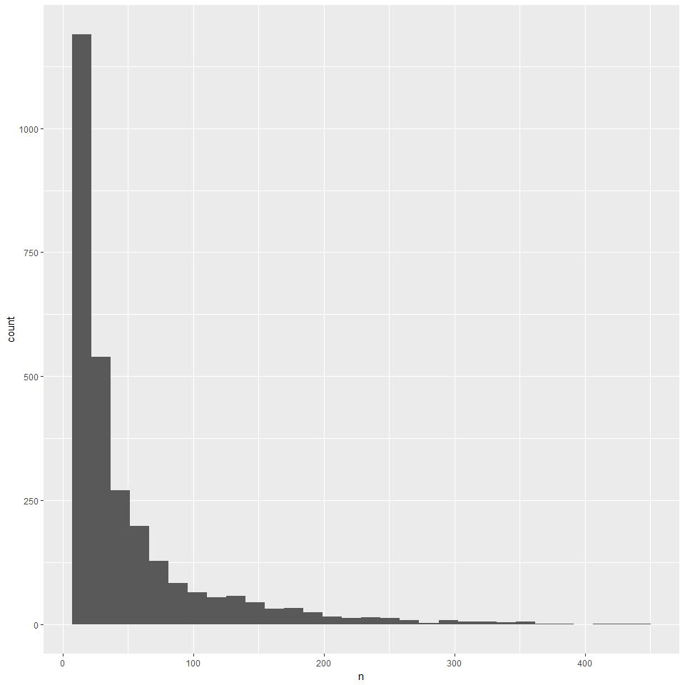
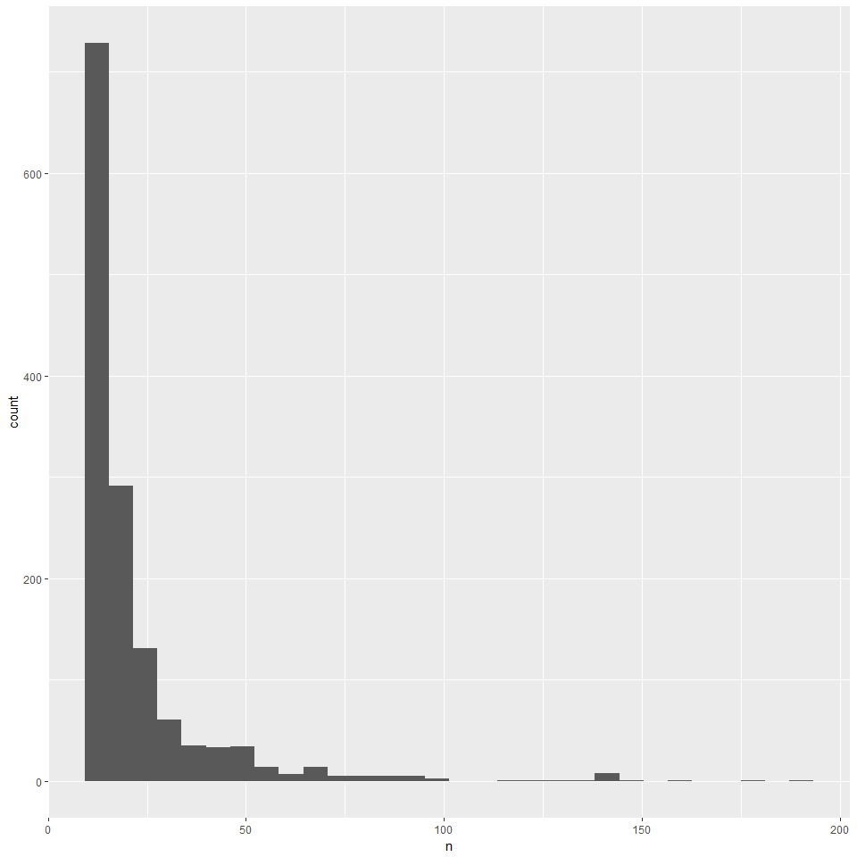

-   This document was rendered last on 2017-10-16

*THIS PROJECT IS STILL UNDER CONSTRUCTION*
------------------------------------------

The intention will be to mask the code as the project approaches completion.

Authors
-------

-   To shower praise for ingenuity on the project, contact [Melody Liu](https://www.linkedin.com/in/meifei-melody-liu/)
-   For criticism of things we couldn't be achieved in 4 weeks contact [Gage Sonntag](https://www.linkedin.com/in/gage-sonntag/)

Executive Summary
-----------------

-   This project was produced for the Text Analytics Workshop for the Winter 2018 Masters of Management Analytics Cohort at Queen's University
-   The goal from the outset was to use text analytics techniques developed in class to examine jobs companies have posted on Indeed in Toronto and employ techniques discussed in class including document clustering, topic modelling, and visualization.

Project Rationale
-----------------

-   A open sourced project working with real world data was desired
-   Other projects can be found scraping DS/Analytics jobs from Indeed. Typically word frequencies for keywords like Python or Hadoop are calculated
-   Moving beyond that, we were interested in topic modelling and how the choice of words signals relationships between roles
-   Job postings fit the 'bag of words' or ngram approach taught in class. Not many employers say **"We don't want someone who knows Python"**

Gathering Data
--------------

-   Beautiful Soup & Selenium were used in Python to access [Indeed](https://www.indeed.ca/jobs?q=analytics&l=Toronto&start=10 "Indeed:Analytics Jobs in Toronto") and scrape unsponsored job titles, companies, and postings
-   1800 jobs were scraped from 9 search terms we believed captured the jobs most MMA students are pursuing.
-   Jobs were passed from Python to R using [Feather](https://blog.rstudio.com/2016/03/29/feather/ "Feather: A Fast On-Disk Format for Data Frames for R and Python, powered by Apache Arrow")

``` r
rm(list=ls())

#list our data files
searches <- c("analytics",
                 "data analyst",
                 "data scientist",
                 "analytics strategy",
                 "data insights",
                 "marketing analytics",
                 "analytics reporting",
                 "machine learning",
                 "business intelligence")

files <- paste("data/feather/",searches,".feather",sep="")

#read and collapse to data frame
datalist <- lapply(as.list(files),function(x){read_feather(x)})
test <- datalist[[1]]
data <- bind_rows(datalist,.id="search")
rm(datalist)

#fix quotations in column names
names(data) <- c("search","company","text","titles","urls")
data <- data %>% select(company,titles,text,search,urls)

#examine the uniqueness of our data
NumJobs <- n_distinct(data$urls)

#reduce to distinct jobs and clean up search column
data <- data[!duplicated(data$urls),]
data$search <- plyr::mapvalues(data$search,
                               from=unique(data$search),
                               to=searches)
```

-   Our data returned 636 unique jobs within our search.
-   It's clear a considerable amount of cleaning is in order


-   We expect 200 jobs for each result, and removing the duplicate jobs in the order they were searched.
-   Interestingly, searching 200 jobs in analytics returns only 113 unique jobs, some redundancy exists.
-   As we search overlapping terms, data sciencist, data insights, fewer and fewer unique jobs are returned
-   Interestingly, each additional search term returns a surprising amount of new jobs. 75 jobs are shown for machine learning that were not found for data scientist, a fairly similar field.
-   Business Intelligence seems to be fairly lateral to other search terms, returning many unique jobs


-   The job search is currently dominated by data scientists, which have become a catch all word. But it's encouraging to see data engineering & machine learning engineering to begin to take hold.
-   Analytics is surprisingly absent, but is likely wrapped into titles like "Manager, Analytics" which is more heterogeneous. Let's take a closer look at where our Analytics jobs are.


-   Here we can see much more heterogeneity in the job titles used by Analytics Practioners vs Data Scientists.


-   This seems to resonate with what the Toronto Job environment is as a whole, Telecom, Banking and consultancies.


-   We see that there are alot of 0 information jobs, postings with only a few words, let's postings with fewer than 300 words.

Exploratory Data Analysis
=========================

-   Let's examine what our unigrams look like without any text processing


-   Looking at at our most common words ignoring traditional stopwords, we see out of the box our data is very messy
-   The boiler plate at the end of each job posting, encouraging people to apply, discussing company acolades and culture distort our analysis. Let's spend some time cleaning up *job specific words* and *html*


-   We are starting to look better. Let's take a look at our bigrams. 
-   This is less fruitful. Likely some bi-grams have value that are less frequent. Words like **machine learning** or **project managment**
-   Let's examine what proportion of jobs words appear in.


-   Of our 25,000 words, 20,000 of them are only mentioned once. Some of this is having a reasonable 'small' dataset. Alot is due to the issues with parsing the variety of html pages from internal job websites.
-   Let's use a 80%/2% rule of thumb on what to filter out.



    ## # A tibble: 5 × 3
    ##                      tokens     n Proportion
    ##                       <chr> <int>      <dbl>
    ## 1      communication skills   190  0.3435805
    ## 2          computer science   180  0.3254973
    ## 3                       c c   159  0.2875226
    ## 4                       p c   147  0.2658228
    ## 5 b.scorecardresearch.com p   143  0.2585895

-   Some of our bi-grams are very interesting. It's fruitful that our top two words are communication skills, then computer science. Let's look at the histogram of what we will be clustering on.



 - This seems to suggest excel, R and SQL are in high demand. Let's examine how inter related these concepts are. - But how often do these skills get mentioned in postings?  - For the skills we have selected, analytics and data scientists have long tails. These are likely associated with the variety of big data tools we discuss: hive, scala, spark etc.


-   It seems that R and Python are mentioned together, likely with companies agnostic towards its use. The mention of hadoop and park alongside python signify that python is the big data language of choice. An obvious result for those familiar with the sparklyR package.

-   SAS has a large pressence, mentioned alongside R and SQL.

-   Excel and Powerpoint are close companions, with powerpoint seeming not to have in common with much else.

 - The network analysis shown shows a few unique clusters. Excel and powerpoint don't seem correlated with the rest of our tech stack, despite the frequent mentions of excel (which presumably are the noun and not the verb) - 3 clusters seem present: - Traditional Analytics - R, SAS, and a smal relationship to - Big Data - Python leveraging Hadoop, AWS, Scala and spark - BI/Data Viz - Tableau, SQL and qlik - Our Trifecta of R, SQL, and excel don't seem as complimentary skills anymore

-   Let's see if our clustering supports this
