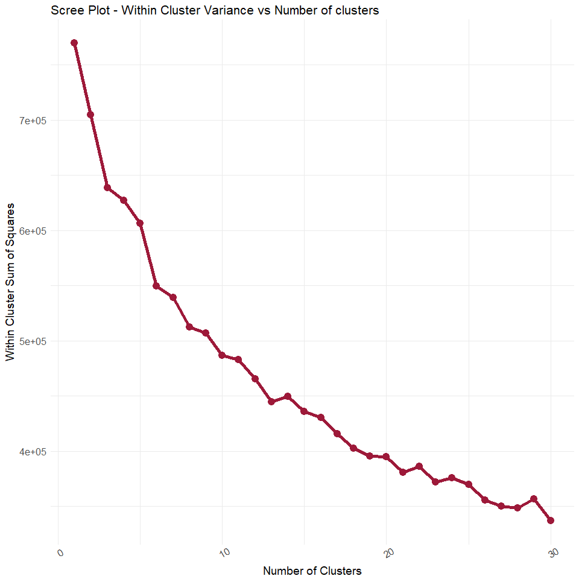

-   This document was rendered last on 2017-10-11

*THIS PROJECT IS STILL UNDER CONSTRUCTION*
------------------------------------------

The intention will be to mask the code as the project approaches completion.

Executive Summary
-----------------

-   This project was produced for the Text Analytics Workshop for the Winter 2018 Masters of Management Analytics Cohort at Queen's University
-   The goal from the outset was to use text analytics techniques developed in class to examine jobs companies have posted on Indeed in Toronto and employ techniques discussed in class including document clustering, topic modelling, and visualization.

Project Rationale
-----------------

-   A open sourced project working with real world data was desired
-   Other projects can be found scraping DS/Analytics jobs from Indeed. Typically word frequencies for keywords like Python or Hadoop are calculated
-   Moving beyond that, we were interested in topic modelling and how the choice of words signals relationships between roles
-   Job postings fit the 'bag of words' or ngram approach taught in class. Not many employers say **"We don't want someone who knows Python"**

``` r
library(feather)
library(tidyverse)
library(tidytext)
library(tm)
library(wordcloud)
library(widyr)
library(ggraph)
library(igraph)
library(knitr)
library(ggridges)
```

Gathering Data
--------------

-   Beautiful Soup & Selenium were used in Python to access [Indeed](https://www.indeed.ca/jobs?q=analytics&l=Toronto&start=10 "Indeed:Analytics Jobs in Toronto") and scrape unsponsored job titles, companies, and postings
-   `later number` unique jobs were scraped from the search terms: `analytics`,`etc`....
-   Jobs were passed from Python to R using [Feather](https://blog.rstudio.com/2016/03/29/feather/ "Feather: A Fast On-Disk Format for Data Frames for R and Python, powered by Apache Arrow")

``` r
rm(list=ls())
#list our data files
searches <- c("analytics",
                 "data analyst",
                 "data scientist",
                 "analytics strategy",
                 "data insights",
                 "marketing analytics",
                 "analytics reporting",
                 "machine learning",
                 "business intelligence")

files <- paste("data/feather/",searches,".feather",sep="")

#read and collapse to data frame
datalist <- lapply(as.list(files),function(x){read_feather(x)})
test <- datalist[[1]]
data <- bind_rows(datalist,.id="search")
rm(datalist)

#fix quotations in column names
names(data) <- c("search","company","text","titles","urls")
data <- data %>% select(company,titles,text,search,urls)

#check if we have redundant jobs
sum(duplicated(data[,2:4]))
```

    ## [1] 755

``` r
#examine the uniqueness of our data
NumJobs <- n_distinct(data$urls)

#reduce to distinct jobs and clean up search column
data <- data[!duplicated(data$urls),]
data$search <- plyr::mapvalues(data$search,
                               from=unique(data$search),
                               to=searches)

kable(head(data[20,]))
```

| company    | titles             | text                                                                                                                                                                                                                                                                                                                                                                                                                                                                                                                                                                                                                                                                                                                                                                | search | urls |
|:-----------|:-------------------|:--------------------------------------------------------------------------------------------------------------------------------------------------------------------------------------------------------------------------------------------------------------------------------------------------------------------------------------------------------------------------------------------------------------------------------------------------------------------------------------------------------------------------------------------------------------------------------------------------------------------------------------------------------------------------------------------------------------------------------------------------------------------|:-------|:-----|
| LoyaltyOne | Manager, Analytics | job description - manager, analytics (0089604)go to the main content section.careers at loyaltyonelearn more about our opportunitieslife at loyaltyoneour teamswelcome. you are not signed in.|my account optionsmy job cart|sign inthis service is set to disconnect automatically after {0} minutes of inactivity. your session will end in {1} minutes.click ok to reset the timer to {0} minutes.you have been signed out.this service is set to sign out after {0} minutes of inactivity.job searchmy jobpagebasic search|advanced search|jobs matching my profile|beginning of the main content section.return to the home pageprintable format  job description - manager, analytics (0089604)job description manager, analytics - (0089604) the opportunity |        |      |

as the analytics manager on the global solutions team, you will lead the delivery of effective, timely and best in class initiatives and consulting engagements globally. we are looking for someone who is a self-starter, comfortable working cross-functionally in partnership with all stakeholders, and an outstanding analytic storyteller. you’ll be detail-oriented and results driven to achieve the organization’s vision for analytics capabilities.   you will be partnering with the consulting, data science, product development and technology teams, to identify and deliver actionable insights. you will collaboratively support client financial goals, partner, member, and campaign measurement, as well as cost optimization.   this is an opportunity to innovate, deepen our existing client relationships, and help establish loyaltyone as a leader in this space.   what you’ll do

lead and manage advanced data analysis to identify and deliver actionable insights (key driver analysis, churn analysis, customer segmentation) lead and execute data extraction, transformation and mapping activities design the analytics plan for engagements, including data requirements and methodology provide thought leadership and coaching to a team of quantitative specialists in the delivery of data insight, development of complex analytical and statistical models, optimization of campaign execution and measurement to achieve financial performance targets build insight and provide interpretation of results linking analytical perspective to objectives and identify new or innovative paths to accomplish or exceed goals work with the client to establish operational processes for analytics execution that ensures appropriate safeguards for data generate and support content focused on analytics thought leadership for external publication participate in business development pitches by sharing thought leadership & advanced analytical solutions that solve customer problems manage the process for standardization of the analytics methodologies and tools and automation  who you are

strong business acumen and understanding of direct marketing, interpreting research, extracting insights and communicating a compelling summary of findings to drive results

solid understanding of the retail industry and how consumer information and analytics is leveraged to generate revenue and financial modeling

a collaborative leader who has a keen interest in developing others

an excellent problem solver with an eye to future opportunities

ability to manage and thrive in a matrix organization and effectively communicate with all audiences what you have

bachelor’s degree in statistics, economics, computer science, applied math or math master’s degree is required (preferred programs include management/business analytics, operations research)    minimum of 3-5 years of directly related work experience in managing analysis and insight delivery minimum of 1 year of supervisory/management experience advanced skills in excel and powerpoint proficent in sas, visualization tools (qlick, tableau, microstrategy), r, python, sql proficiency with spark, scala and alteryx. experience with aws and cloud deployments is preferred about loyaltyone

loyaltyone is a global leader in the design and implementation of coalition loyalty programs, customer analytics, and loyalty services for fortune 1000 clients around the world. loyaltyone has over 20 years history leveraging data-driven insights to develop and operate some of the world's most effective loyalty programs and customer-centric solutions. these include the air miles reward program, north america's premier coalition loyalty program, precima, the global retail strategy and analytics arm, loyaltyone consulting, european-based brandloyalty, and latin america's leading coalition program, dotz. loyaltyone is an alliance data company. www.loyalty.com   about ads   alliance data® (nyse: ads) is a leading global provider of data-driven marketing and loyalty solutions serving large, consumer-based industries. the company creates and deploys customized solutions, enhancing the critical customer marketing experience; the result is measurably changing consumer behavior while driving business growth and profitability for some of today's most recognizable brands. alliance data helps its clients create and increase customer loyalty through solutions that engage millions of customers each day across multiple touch points using traditional, digital, mobile and emerging technologies. an s&p 500 and fortune 500 company headquartered in plano, texas, alliance data consists of three businesses that together employ more than 16,000 associates at approximately 100 locations worldwide. www.alliancedata.com   employment opportunity employer. accordingly, we will make reasonable accommodations to respond to the needs of people with disabilities in accordance with legislation.   alliance data participates in e-verify primary location: can - canada-2084 - ontario-50419 - toronto-40-loy - torontowork locations: 40-loy - toronto   toronto m5a 0l6job: client servicesorganization: loyaltyoneschedule: regularjob type: full-timejob posting: oct 3, 2017, 4:43:27 pmdivision: loyalty    accessibility   terms of use   privacy © 2016 loyaltyone co. analytics <https://www.indeed.ca/rc/clk?jk=62d126d941832fcd&fccid=2018a73c53179d10> - Our data returned `NumJobs` unique jobs within our search. - It's clear a considerable amount of cleaning is in order

``` r
RemovePattern <- function(vector,pattern){gsub(pattern=pattern,replacement=" ",vector)}
data <- dmap(data,RemovePattern,"\n")
data <- dmap(data,RemovePattern,"\\(")   
data <- dmap(data,RemovePattern,"\\)")
data <- dmap(data,RemovePattern,"\\{[a-zA-Z0-9]\\}")
kable(data[20,])
```

| company    | titles             | text                                                                                                                                                                                                                                                                                                                                                                                                                                                                                                                                                                                                                                                                                                                                                                                                                                                                                                                                                                                                                                                                                                                                                                                                                                                                                                                                                                                                                                                                                                                                                                                                                                                                                                                                                                                                                                                                                                                                                                                                                                                                                                                                                                                                                                                                                                                                                                                                                                                                                                                                                                                                                                                                                                                                                                                                                                                                                                                                                                                                                                                                                                                                                                                                                                                                                                                                                                                                                                                                                                                                                                                                                                                                                                                                                                                                                                                                                                                                                                                                                                                                                                                                                                                                                                                                                                                                                                                                                                                                                                                                                                                                                                                                                                                                                                                                                                                                                                                                                                                                                                                                                                                                                                                                                                                                                                                                                                                                                                                                                                                                                                                                                                                                                                                                                                                                                                                                                                                                                                                                                                                                                                                                                                                                                                      | search    | urls                                                                      |
|:-----------|:-------------------|:------------------------------------------------------------------------------------------------------------------------------------------------------------------------------------------------------------------------------------------------------------------------------------------------------------------------------------------------------------------------------------------------------------------------------------------------------------------------------------------------------------------------------------------------------------------------------------------------------------------------------------------------------------------------------------------------------------------------------------------------------------------------------------------------------------------------------------------------------------------------------------------------------------------------------------------------------------------------------------------------------------------------------------------------------------------------------------------------------------------------------------------------------------------------------------------------------------------------------------------------------------------------------------------------------------------------------------------------------------------------------------------------------------------------------------------------------------------------------------------------------------------------------------------------------------------------------------------------------------------------------------------------------------------------------------------------------------------------------------------------------------------------------------------------------------------------------------------------------------------------------------------------------------------------------------------------------------------------------------------------------------------------------------------------------------------------------------------------------------------------------------------------------------------------------------------------------------------------------------------------------------------------------------------------------------------------------------------------------------------------------------------------------------------------------------------------------------------------------------------------------------------------------------------------------------------------------------------------------------------------------------------------------------------------------------------------------------------------------------------------------------------------------------------------------------------------------------------------------------------------------------------------------------------------------------------------------------------------------------------------------------------------------------------------------------------------------------------------------------------------------------------------------------------------------------------------------------------------------------------------------------------------------------------------------------------------------------------------------------------------------------------------------------------------------------------------------------------------------------------------------------------------------------------------------------------------------------------------------------------------------------------------------------------------------------------------------------------------------------------------------------------------------------------------------------------------------------------------------------------------------------------------------------------------------------------------------------------------------------------------------------------------------------------------------------------------------------------------------------------------------------------------------------------------------------------------------------------------------------------------------------------------------------------------------------------------------------------------------------------------------------------------------------------------------------------------------------------------------------------------------------------------------------------------------------------------------------------------------------------------------------------------------------------------------------------------------------------------------------------------------------------------------------------------------------------------------------------------------------------------------------------------------------------------------------------------------------------------------------------------------------------------------------------------------------------------------------------------------------------------------------------------------------------------------------------------------------------------------------------------------------------------------------------------------------------------------------------------------------------------------------------------------------------------------------------------------------------------------------------------------------------------------------------------------------------------------------------------------------------------------------------------------------------------------------------------------------------------------------------------------------------------------------------------------------------------------------------------------------------------------------------------------------------------------------------------------------------------------------------------------------------------------------------------------------------------------------------------------------------------------------------------------------------------------------------------------------------------------------------|:----------|:--------------------------------------------------------------------------|
| LoyaltyOne | Manager, Analytics | job description - manager, analytics 0089604 go to the main content section.careers at loyaltyonelearn more about our opportunitieslife at loyaltyoneour teamswelcome. you are not signed in.|my account optionsmy job cart|sign inthis service is set to disconnect automatically after minutes of inactivity. your session will end in minutes.click ok to reset the timer to minutes.you have been signed out.this service is set to sign out after minutes of inactivity.job searchmy jobpagebasic search|advanced search|jobs matching my profile|beginning of the main content section.return to the home pageprintable format  job description - manager, analytics 0089604 job description manager, analytics -  0089604  the opportunity as the analytics manager on the global solutions team, you will lead the delivery of effective, timely and best in class initiatives and consulting engagements globally. we are looking for someone who is a self-starter, comfortable working cross-functionally in partnership with all stakeholders, and an outstanding analytic storyteller. you’ll be detail-oriented and results driven to achieve the organization’s vision for analytics capabilities.   you will be partnering with the consulting, data science, product development and technology teams, to identify and deliver actionable insights. you will collaboratively support client financial goals, partner, member, and campaign measurement, as well as cost optimization.   this is an opportunity to innovate, deepen our existing client relationships, and help establish loyaltyone as a leader in this space.   what you’ll do lead and manage advanced data analysis to identify and deliver actionable insights key driver analysis, churn analysis, customer segmentation lead and execute data extraction, transformation and mapping activities design the analytics plan for engagements, including data requirements and methodology provide thought leadership and coaching to a team of quantitative specialists in the delivery of data insight, development of complex analytical and statistical models, optimization of campaign execution and measurement to achieve financial performance targets build insight and provide interpretation of results linking analytical perspective to objectives and identify new or innovative paths to accomplish or exceed goals work with the client to establish operational processes for analytics execution that ensures appropriate safeguards for data generate and support content focused on analytics thought leadership for external publication participate in business development pitches by sharing thought leadership & advanced analytical solutions that solve customer problems manage the process for standardization of the analytics methodologies and tools and automation  who you are strong business acumen and understanding of direct marketing, interpreting research, extracting insights and communicating a compelling summary of findings to drive results solid understanding of the retail industry and how consumer information and analytics is leveraged to generate revenue and financial modeling a collaborative leader who has a keen interest in developing others an excellent problem solver with an eye to future opportunities ability to manage and thrive in a matrix organization and effectively communicate with all audiences what you have bachelor’s degree in statistics, economics, computer science, applied math or math master’s degree is required preferred programs include management/business analytics, operations research     minimum of 3-5 years of directly related work experience in managing analysis and insight delivery minimum of 1 year of supervisory/management experience advanced skills in excel and powerpoint proficent in sas, visualization tools qlick, tableau, microstrategy , r, python, sql proficiency with spark, scala and alteryx. experience with aws and cloud deployments is preferred about loyaltyone loyaltyone is a global leader in the design and implementation of coalition loyalty programs, customer analytics, and loyalty services for fortune 1000 clients around the world. loyaltyone has over 20 years history leveraging data-driven insights to develop and operate some of the world's most effective loyalty programs and customer-centric solutions. these include the air miles reward program, north america's premier coalition loyalty program, precima, the global retail strategy and analytics arm, loyaltyone consulting, european-based brandloyalty, and latin america's leading coalition program, dotz. loyaltyone is an alliance data company. www.loyalty.com   about ads   alliance data® nyse: ads is a leading global provider of data-driven marketing and loyalty solutions serving large, consumer-based industries. the company creates and deploys customized solutions, enhancing the critical customer marketing experience; the result is measurably changing consumer behavior while driving business growth and profitability for some of today's most recognizable brands. alliance data helps its clients create and increase customer loyalty through solutions that engage millions of customers each day across multiple touch points using traditional, digital, mobile and emerging technologies. an s&p 500 and fortune 500 company headquartered in plano, texas, alliance data consists of three businesses that together employ more than 16,000 associates at approximately 100 locations worldwide. www.alliancedata.com   employment opportunity employer. accordingly, we will make reasonable accommodations to respond to the needs of people with disabilities in accordance with legislation.   alliance data participates in e-verify primary location: can - canada-2084 - ontario-50419 - toronto-40-loy - torontowork locations: 40-loy - toronto   toronto m5a 0l6job: client servicesorganization: loyaltyoneschedule: regularjob type: full-timejob posting: oct 3, 2017, 4:43:27 pmdivision: loyalty    accessibility   terms of use   privacy © 2016 loyaltyone co. | analytics | <https://www.indeed.ca/rc/clk?jk=62d126d941832fcd&fccid=2018a73c53179d10> |

``` r
#investigate redundant jobs. Should return 200/each if they are all unique.

rollup <- data %>%
     group_by(search) %>%
     summarize(NumberUniquePostings=n())

str(rollup)
```

    ## Classes 'tbl_df', 'tbl' and 'data.frame':    9 obs. of  2 variables:
    ##  $ search              : chr  "analytics" "analytics reporting" "analytics strategy" "business intelligence" ...
    ##  $ NumberUniquePostings: int  100 47 65 74 82 50 90 57 71

``` r
#sort by search order
kable(left_join(data.frame(search=searches),rollup,by="search"))
```

| search                |  NumberUniquePostings|
|:----------------------|---------------------:|
| analytics             |                   100|
| data analyst          |                    82|
| data scientist        |                    90|
| analytics strategy    |                    65|
| data insights         |                    50|
| marketing analytics   |                    71|
| analytics reporting   |                    47|
| machine learning      |                    57|
| business intelligence |                    74|

-   We expect 200 jobs for each result, and removing the duplicate jobs in the order they were searched.
-   Interestingly, searching 200 jobs in analytics returns only 113 unique jobs, some redundancy exists.
-   As we search overlapping terms, data sciencist, data insights, fewer and fewer unique jobs are returned
-   Interestingly, each additional search term returns a surprising amount of new jobs. 75 jobs are shown for machine learning that were not found for data scientist, a fairly similar field.
-   Business Intelligence seems to be fairly lateral to other search terms, returning many unique jobs

``` r
#how long are our jobs
data %>%
     unnest_tokens(token="words",output="unigrams",input=text) %>%
     group_by(urls) %>%
     count(search,urls,sort=TRUE) %>%
     filter(n<3000) %>%
     ggplot(aes(x=n,y=search))+geom_density_ridges()
```


-   We see that there are alot of 0 information jobs, postings with only a few words, let's look at what some of those are.

``` r
MinWords <- 300

empty_urls <- data %>%
     unnest_tokens(token="words",output="unigrams",input=text) %>%
     group_by(urls) %>%
     count(urls,sort=TRUE) %>%
     filter(n < MinWords)

data %>% 
     filter(urls %in% empty_urls$urls) %>%
     head()
```

    ## # A tibble: 6 × 5
    ##                                         company
    ##                                           <chr>
    ## 1                 Molson Coors Brewing Company 
    ## 2                                       Loblaw 
    ## 3                                          RBC 
    ## 4                               Edelman Canada 
    ## 5                                   GS1 Canada 
    ## 6    The Cadillac Fairview Corporation Limited 
    ## # ... with 4 more variables: titles <chr>, text <chr>, search <chr>,
    ## #   urls <chr>

``` r
data <- data %>% 
     filter(!urls %in% empty_urls$urls)
```

-   We see here a variety of failed scrapings, or 0 info postings

``` r
long_postings <- data %>%
     unnest_tokens(token="words",output="unigrams",input=text) %>%
     group_by(urls) %>%
     count(urls,sort=TRUE) %>%
     filter(n >3000)

kable(data %>%
          filter(urls %in% long_postings$urls) %>%
           head(1))
```

| company  | titles         | text                                                                                                                                                                                                                                                                                                                                                                                                                                                                                                                                                                                                                                                                                                                                                                                                                                                                                                                                                                                                                                                                                                                                                                                                                                                                                                                                                                                                                                                                                                                                                                                                                                                                                                                                                                                                                                                                                                                                                                                                                                                                                                                                                                                                                                                                                                                                                                                                                                                                                                                                                                                                                                                                                                                                                                                                                                                                                                                                                                                                                                                                                                                                                                                                                                                                                                                                                                                                                                                                                                                                                                                                                                                                                                                                                                                                                                                                                                                                                                                                                                                                                                                                                                                                                                                                                                                                                                                                                                                                                                                                                                                                                                                                                                                                                                                                                                                                                                                                                                                                                                                                                                                                                                                                                                                                                                                                                                                                                                                                                                                                                                                                                                                                                                                                                                                                                                                                                                                                                                                                                                                                                                                                                                                                                                                                                                                                                                                                                                                                                                                                                                                                                                                                                                                                                                                                                                                                                                                                                                                                                                                                                                                                                                                                                                                                                                                                                                                                                                                                                                                                                                                                                                                                                                                                                                                                                                                                                                                                                                                                                                                                                                                                                                                                                                                                                                                                                                                                                                                                                                                                                                                                                                                                                                                                                                                                                                                                                                                                                                                                                                                                                                                                                                                                                                                                                                                                                                                                                                                                                                                                                                                                                                                                                                                                                                                                                                                                                                                                                                                                                                                                                                                                                                                                                                                                                                                                                                                                                                                                                                                                                                                                                                                                                                                                                                                                                                                                                                                                                                                                                                                                                                                                                                                                                                                                                                                                                                                                                                                                                                                                                                                                                                                                                                                                                                                                                                                                                                                                                                                                                                                                                                                                                                                                                                                                                                                                                                                                                                                                                                                                                                                                                                                                                                                                                                                                                                                                                                                                                                                                                                                                                                                                                                                                                                                                                                                                                                                                                                                                                                                                                                                                                                                                                                                                                                                                                                                                                                                                                                                                                                                                                                                                                                                                                                                                                                                                                                                                                                                                                                                                                                                                                                                                                                                                                                                                                                                                                                                                                                                                                                                                                                                                                                                                                                                                                                                                                                                                                                                                                                                                                                                                                                                                                                                                                                                                                                                                                                                                                                                                                                                                                                                                                                                                                                                                                                                                                                                                                                                                                                                                                                                                                                                                                                                                                                                                                                                                                                                                                                                                                                                                                                                                                                                                                                                                                                                                                                                                                                                                                                                                                                                                                                                                                                                                                                                                                                                                                                                                                                                                                                                                                                                                                                                                                                                                                                                                                                                                                                                                                                                                                                                                                                                                                                                                                                                                                                                                                                                                                                                                                                                                                                                                                                                                                                                                                                                                                                                                                                                                                                                                                                                                                                                                                                                                                                                                                                                                                                                                                                                                                                                                                                                                                                                                                                                                                                                                                                                                                                                                                                                                                                                                                                                                                                                                                                                                                                                                                                                                                                                                                                                                                                                                                                                                                                                                                                                                                                                                                                                                                                                                                                                                                                                                                                                                                                                                                                                                                                                                                                                                                                                                                                                                                                                                                                                                                                                                                                                                                                                                                                                                                                                                                                                                                                                                                                                                                                                                                                                                                                                                                                                                                                                                                                                                                                                                                                                                                                                                                                                                                                                                                                                                                                                                                                                                                                                                                                                                                                                                                                                                                                                                                                                                                                                                                                                                                                                                                                                                                                                                                                                                                                                                                                                                                                                                                                                                                                                                                                                                                                                                                                                                                                                                                                                                                                                                                                                                                                                                                                                                                                                                                                                                                                                                                                                                                                                                                                                                                                                                                                                                                                                                                                                                                                                                                                                                                                                                                                                                                                                                                                                                                                                                                                                                                                                                                                                                                                                                                                                                                                                                                                                                                                                                                                                                                                                                                                                                                                                                                                                                                                                                                                                                                                                                                                                                                       | search    | urls                                                                      |
|:---------|:---------------|:-----------------------------------------------------------------------------------------------------------------------------------------------------------------------------------------------------------------------------------------------------------------------------------------------------------------------------------------------------------------------------------------------------------------------------------------------------------------------------------------------------------------------------------------------------------------------------------------------------------------------------------------------------------------------------------------------------------------------------------------------------------------------------------------------------------------------------------------------------------------------------------------------------------------------------------------------------------------------------------------------------------------------------------------------------------------------------------------------------------------------------------------------------------------------------------------------------------------------------------------------------------------------------------------------------------------------------------------------------------------------------------------------------------------------------------------------------------------------------------------------------------------------------------------------------------------------------------------------------------------------------------------------------------------------------------------------------------------------------------------------------------------------------------------------------------------------------------------------------------------------------------------------------------------------------------------------------------------------------------------------------------------------------------------------------------------------------------------------------------------------------------------------------------------------------------------------------------------------------------------------------------------------------------------------------------------------------------------------------------------------------------------------------------------------------------------------------------------------------------------------------------------------------------------------------------------------------------------------------------------------------------------------------------------------------------------------------------------------------------------------------------------------------------------------------------------------------------------------------------------------------------------------------------------------------------------------------------------------------------------------------------------------------------------------------------------------------------------------------------------------------------------------------------------------------------------------------------------------------------------------------------------------------------------------------------------------------------------------------------------------------------------------------------------------------------------------------------------------------------------------------------------------------------------------------------------------------------------------------------------------------------------------------------------------------------------------------------------------------------------------------------------------------------------------------------------------------------------------------------------------------------------------------------------------------------------------------------------------------------------------------------------------------------------------------------------------------------------------------------------------------------------------------------------------------------------------------------------------------------------------------------------------------------------------------------------------------------------------------------------------------------------------------------------------------------------------------------------------------------------------------------------------------------------------------------------------------------------------------------------------------------------------------------------------------------------------------------------------------------------------------------------------------------------------------------------------------------------------------------------------------------------------------------------------------------------------------------------------------------------------------------------------------------------------------------------------------------------------------------------------------------------------------------------------------------------------------------------------------------------------------------------------------------------------------------------------------------------------------------------------------------------------------------------------------------------------------------------------------------------------------------------------------------------------------------------------------------------------------------------------------------------------------------------------------------------------------------------------------------------------------------------------------------------------------------------------------------------------------------------------------------------------------------------------------------------------------------------------------------------------------------------------------------------------------------------------------------------------------------------------------------------------------------------------------------------------------------------------------------------------------------------------------------------------------------------------------------------------------------------------------------------------------------------------------------------------------------------------------------------------------------------------------------------------------------------------------------------------------------------------------------------------------------------------------------------------------------------------------------------------------------------------------------------------------------------------------------------------------------------------------------------------------------------------------------------------------------------------------------------------------------------------------------------------------------------------------------------------------------------------------------------------------------------------------------------------------------------------------------------------------------------------------------------------------------------------------------------------------------------------------------------------------------------------------------------------------------------------------------------------------------------------------------------------------------------------------------------------------------------------------------------------------------------------------------------------------------------------------------------------------------------------------------------------------------------------------------------------------------------------------------------------------------------------------------------------------------------------------------------------------------------------------------------------------------------------------------------------------------------------------------------------------------------------------------------------------------------------------------------------------------------------------------------------------------------------------------------------------------------------------------------------------------------------------------------------------------------------------------------------------------------------------------------------------------------------------------------------------------------------------------------------------------------------------------------------------------------------------------------------------------------------------------------------------------------------------------------------------------------------------------------------------------------------------------------------------------------------------------------------------------------------------------------------------------------------------------------------------------------------------------------------------------------------------------------------------------------------------------------------------------------------------------------------------------------------------------------------------------------------------------------------------------------------------------------------------------------------------------------------------------------------------------------------------------------------------------------------------------------------------------------------------------------------------------------------------------------------------------------------------------------------------------------------------------------------------------------------------------------------------------------------------------------------------------------------------------------------------------------------------------------------------------------------------------------------------------------------------------------------------------------------------------------------------------------------------------------------------------------------------------------------------------------------------------------------------------------------------------------------------------------------------------------------------------------------------------------------------------------------------------------------------------------------------------------------------------------------------------------------------------------------------------------------------------------------------------------------------------------------------------------------------------------------------------------------------------------------------------------------------------------------------------------------------------------------------------------------------------------------------------------------------------------------------------------------------------------------------------------------------------------------------------------------------------------------------------------------------------------------------------------------------------------------------------------------------------------------------------------------------------------------------------------------------------------------------------------------------------------------------------------------------------------------------------------------------------------------------------------------------------------------------------------------------------------------------------------------------------------------------------------------------------------------------------------------------------------------------------------------------------------------------------------------------------------------------------------------------------------------------------------------------------------------------------------------------------------------------------------------------------------------------------------------------------------------------------------------------------------------------------------------------------------------------------------------------------------------------------------------------------------------------------------------------------------------------------------------------------------------------------------------------------------------------------------------------------------------------------------------------------------------------------------------------------------------------------------------------------------------------------------------------------------------------------------------------------------------------------------------------------------------------------------------------------------------------------------------------------------------------------------------------------------------------------------------------------------------------------------------------------------------------------------------------------------------------------------------------------------------------------------------------------------------------------------------------------------------------------------------------------------------------------------------------------------------------------------------------------------------------------------------------------------------------------------------------------------------------------------------------------------------------------------------------------------------------------------------------------------------------------------------------------------------------------------------------------------------------------------------------------------------------------------------------------------------------------------------------------------------------------------------------------------------------------------------------------------------------------------------------------------------------------------------------------------------------------------------------------------------------------------------------------------------------------------------------------------------------------------------------------------------------------------------------------------------------------------------------------------------------------------------------------------------------------------------------------------------------------------------------------------------------------------------------------------------------------------------------------------------------------------------------------------------------------------------------------------------------------------------------------------------------------------------------------------------------------------------------------------------------------------------------------------------------------------------------------------------------------------------------------------------------------------------------------------------------------------------------------------------------------------------------------------------------------------------------------------------------------------------------------------------------------------------------------------------------------------------------------------------------------------------------------------------------------------------------------------------------------------------------------------------------------------------------------------------------------------------------------------------------------------------------------------------------------------------------------------------------------------------------------------------------------------------------------------------------------------------------------------------------------------------------------------------------------------------------------------------------------------------------------------------------------------------------------------------------------------------------------------------------------------------------------------------------------------------------------------------------------------------------------------------------------------------------------------------------------------------------------------------------------------------------------------------------------------------------------------------------------------------------------------------------------------------------------------------------------------------------------------------------------------------------------------------------------------------------------------------------------------------------------------------------------------------------------------------------------------------------------------------------------------------------------------------------------------------------------------------------------------------------------------------------------------------------------------------------------------------------------------------------------------------------------------------------------------------------------------------------------------------------------------------------------------------------------------------------------------------------------------------------------------------------------------------------------------------------------------------------------------------------------------------------------------------------------------------------------------------------------------------------------------------------------------------------------------------------------------------------------------------------------------------------------------------------------------------------------------------------------------------------------------------------------------------------------------------------------------------------------------------------------------------------------------------------------------------------------------------------------------------------------------------------------------------------------------------------------------------------------------------------------------------------------------------------------------------------------------------------------------------------------------------------------------------------------------------------------------------------------------------------------------------------------------------------------------------------------------------------------------------------------------------------------------------------------------------------------------------------------------------------------------------------------------------------------------------------------------------------------------------------------------------------------------------------------------------------------------------------------------------------------------------------------------------------------------------------------------------------------------------------------------------------------------------------------------------------------------------------------------------------------------------------------------------------------------------------------------------------------------------------------------------------------------------------------------------------------------------------------------------------------------------------------------------------------------------------------------------------------------------------------------------------------------------------------------------------------------------------------------------------------------------------------------------------------------------------------------------------------------------------------------------------------------------------------------------------------------------------------------------------------------------------------------------------------------------------------------------------------------------------------------------------------------------------------------------------------------------------------------------------------------------------------------------------------------------------------------------------------------------------------------------------------------------------------------------------------------------------------------------------------------------------------------------------------------------------------------------------------------------------------------------------------------------------------------------------------------------------------------------------------------------------------------------------------------------------------------------------------------------------------------------------------------------------------------------------------------------------------------------------------------------------------------------------------------------------------------------------------------------------------------------------------------------------------------------------------------------------------------------------------------------------------------------------------------------------------------------------------------------------------------------------------------------------------------------------------------------------------------------------------------------------------------------------------------------------------------------------------------------------------------------------------------------------------------------------------------------------------------------------------------------------------------------------------------------------------------------------------------------------------------------------------------------------------------------------------------------------------------------------------------------------------------------------------------------------------------------------------------------------------------------------------------------------------------------------------------------------------------------------------------------------------------------------------------------------------------------------------------------------------------------------------------------------------------------------------------------------------------------------------------------------------------------------------------------------------------------------------------------------------------------------------------------------------------------------------------------------------------------------------------------------------------------------------------------------------------------------------------------------------------------------------------------------------------------------------------------------------------------------------------------------------------------------------------------------------------------------------------------------------------------------------------------------------------------------------------------------------------------------------------------------------------------------------------------------------------------------------------------------------------------------------------------------------------------------------------------------------------------------------------------------------------------------------------------------------------------------------------------------------------------------------------------------------------------------------------------------------------------------------------------------------------------------------------------------------------------------------------------------------------------------------------------------------------------------------------------------------------------------------------------------------------------------------------------------------------------------------------------------------------------------------------------------------------------------------------------------------------------------------------------------------------------------------------------------------------------------------------------------------------------------------------------------------------------------------------------------------------------------------------------------------------------------------------------------------------------------------------------------------------------------------------------------------------------------------------------------------------------------------------------------------------------------------------------------------------------------------------------------------------------------------------------------------------------------------------------------------------------------------------------------------------------------------------------------------------------------------------------------------------------------------------------------------------------------------------------------------------------------------------------------------------------------------------------------------------------------------------------------------------------------------------------------------------------------------------------------------------------------------------------------------------------------------------------------------------------------------------------------------------------------------------------------------------------------------------------------------------------------------------------------------------------------------------------------------------------------------------------------------------------------------------------------------------------------------------------------------------------------------------------------------------------------------------------------------------------------------------------------------------------------------------------------------------------------------------------------------------------------------------------------------------------------------------------------------------------------------------------------------------------------------------------------------------------------------------------------------------------------------------------------------------------------------------------------------------------------------------------------------------------------------------------------------------------------------------------------------------------------------------------------------------------------------------------------------------------------------------------------------------------------------------------------------------------------------------------------------------------------------------------------------------------------------------------------------------------------------------------------------------------------------------------------------------------------------------------------------------------------------------------------------------------------------------------------------------------------------------------------------------------------------------------------------------------------------------------------------------------------------------------------------------------------------------------------------------------------------------------------------|:----------|:--------------------------------------------------------------------------|
| Deloitte | Data Scientist | data scientist enter job title or location search menu open clear text search jobs recent searches deloitte home about deloitte job cart location: united states global english global english albania & kosova english albania english shqiperia shqiptar albania albanian algérie français algeria french angola português angola portuguese argentina español argentina spanish armenia english armenia english <U+0570><U+0561><U+0575><U+0561><U+057D><U+057F><U+0561><U+0576> <U+0570><U+0561><U+0575><U+0565><U+0580><U+0565><U+0576> armenia armenian australia english australia english österreich deutsch austria german az<U+0259>rbaycan azeri azerbaijan azeri azerbaijan english azerbaijan english bahamas english bahamas english bahrain english bahrain english barbados english barbados english <U+0431><U+0435><U+043B><U+0430><U+0440><U+0443><U+0441><U+044C> <U+0440><U+0443><U+0441><U+0441><U+043A><U+0438><U+0439> belarus russian belarus english belarus english belgium english belgium english bénin français benin french bermuda english bermuda english bolivia español bolivia, plurinational state of spanish bosna i hercegovina bosanski bosnia and herzegovina bosnian bosnia and herzegovina english bosnia and herzegovina english brasil português brazil portuguese brazil english brazil english british virgin islands english british virgin islands english brunei darussalam english brunei darussalam english <U+0431><U+044A><U+043B><U+0433><U+0430><U+0440><U+0438><U+044F> <U+0431><U+044A><U+043B><U+0433><U+0430><U+0440><U+0441><U+043A><U+0438> bulgaria bulgarian bulgaria english bulgaria english cambodia english cambodia english cameroun français cameroon french cameroon english cameroon english canada english canada english canada français canada french cayman islands english cayman islands english channel islands and isle of man english channel islands and isle of man english chile español chile spanish <U+4E2D><U+56FD> <U+7B80><U+4F53><U+4E2D><U+6587> china chinese china english china english colombia español colombia spanish congo français congo french costa rica español costa rica spanish hrvatska hrvatski croatia croatian croatia english croatia english cyprus english cyprus english ceská republika ceština czech republic czech czech republic english czech republic english république démocratique du congo français democratic republic of the congo french democratic republic of the congo english democratic republic of the congo english danmark dansk denmark danish república dominicana español dominican republic spanish dutch caribbean english dutch caribbean english ecuador español ecuador spanish egypt english egypt english el salvador español el salvador spanish el salvador english el salvador english guinée equatoriale / guinée équatoriale français equatorial guinea french eesti eesti estonia estonian estonia english estonia english ethiopia english ethiopia english finland english finland english france français france french gabon français gabon french georgia english georgia english <U+10E1><U+10D0><U+10E5><U+10D0><U+10E0><U+10D7><U+10D5><U+10D4><U+10DA><U+10DD> <U+10E5><U+10D0><U+10E0><U+10D7><U+10E3><U+10DA><U+10D8> georgia georgian deutschland deutsch germany german ghana english ghana english gibraltar english gibraltar english greece english greece english guam english guam english guatemala español guatemala spanish guatemala english guatemala english honduras español honduras spanish hong kong chinese hong kong chinese hong kong english hong kong english magyarország magyar hungary hungarian hungary english hungary english iceland icelandic iceland icelandic india english india english india offices of the us english india offices of the us english indonesia english indonesia english iraq english iraq english ireland english ireland english islamic finance english islamic finance english israel english israel english italia italiano italy italian côte d'ivoire français ivory coast french <U+65E5><U+672C> <U+65E5><U+672C><U+8A9E> japan japanese japan english japan english jordan english jordan english <U+043A><U+0430><U+0437><U+0430><U+0445><U+0441><U+0442><U+0430><U+043D> <U+0440><U+0443><U+0441><U+0441><U+043A><U+0438><U+0439> kazakhstan russian kazakhstan english kazakhstan english kenya english kenya english <U+B300><U+D55C><U+BBFC><U+AD6D> <U+D55C><U+AD6D><U+C5B4> korea korean korea english korea english kuwait english kuwait english <U+043A><U+044B><U+0440><U+0433><U+044B><U+0437><U+0441><U+0442><U+0430><U+043D> <U+0440><U+0443><U+0441><U+0441><U+043A><U+0438><U+0439> kyrgyzstan russian lao pdr english lao pdr english latvia english latvia english lebanon english lebanon english libya english libya english liechtenstein german liechtenstein german lietuva lietuvos lithuania lithuanian lithuania english lithuania english luxembourg english luxembourg english macau chinese macau chinese macau english macau english macedonia english macedonia english malaysia english malaysia english malta english malta english mauritius english mauritius english méxico español mexico spanish middle east english middle east english moldova româna moldova romanian mongolia english mongolia english montenegro english montenegro english maroc français morocco french myanmar english myanmar english namibia english namibia english nederland nederlands netherlands dutch new zealand english new zealand english nicaragua español nicaragua spanish nigeria english nigeria english norge norsk norway norwegian oman english oman english pakistan english pakistan english palestinian ruled territories english palestinian ruled territories english panamá español panama spanish papua new guinea english papua new guinea english paraguay español paraguay spanish perú español peru spanish philippines english philippines english polska polski poland polish poland english poland english portugal português portugal portuguese portugal english portugal english qatar english qatar english romania româna romania romanian romania english romania english <U+0440><U+043E><U+0441><U+0441><U+0438><U+044F> <U+0440><U+0443><U+0441><U+0441><U+043A><U+0438><U+0439> russia russian russia english russia english saudi arabia english saudi arabia english sénégal français senegal french <U+0441><U+0440><U+0431><U+0438><U+0458><U+0430> <U+0441><U+0440><U+043F><U+0441><U+043A><U+0438> serbia serbian serbia english serbia english singapore english singapore english slovenská republika slovencina slovak republic slovak slovak republic english slovak republic english slovenija slovenšcina slovenia slovenian slovenia english slovenia english south africa english south africa english españa español spain spanish sverige svenska sweden swedish switzerland english switzerland english schweiz deutsch switzerland german suisse français switzerland french syria english syria english <U+53F0><U+7063> <U+7E41><U+4F53><U+4E2D><U+6587> taiwan chinese taiwan english taiwan english <U+0442><U+0430><U+0434><U+0436><U+0438><U+043A><U+0438><U+0441><U+0442><U+0430><U+043D> <U+0440><U+0443><U+0441><U+0441><U+043A><U+0438><U+0439> tajikistan russian tanzania english tanzania english thailand english thailand english timor-leste english timor-leste english togo français togo french trinidad and tobago english trinidad and tobago english tunisie français tunisia french türkiye türk turkey turkish turkey english turkey english us - corporate finance english us - corporate finance english uganda english uganda english <U+0443><U+043A><U+0440><U+0430><U+0457><U+043D><U+0430> <U+0443><U+043A><U+0440><U+0430><U+0457><U+043D><U+0441><U+044C><U+043A><U+0438><U+0439> ukraine ukrainian ukraine english ukraine english united arab emirates english united arab emirates english united kingdom english united kingdom english united states english united states english united states virgin islands english united states virgin islands english uruguay español uruguay spanish <U+0443><U+0437><U+0431><U+0435><U+043A><U+0438><U+0441><U+0442><U+0430><U+043D> <U+0440><U+0443><U+0441><U+0441><U+043A><U+0438><U+0439> uzbekistan russian venezuela español venezuela spanish vietnam english vietnam english yemen english yemen english available in 145 locations and 34 languages students experienced careers accounting & auditing actuarial administrative and support services business development / sales / marketing communications and public relations finance human resources information technology legal management consulting mergers & acquisitions risk management tax this site uses cookies to provide you with a more responsive and personalized service. by using this site you agree to our use of cookies. please read our cookie notice for more information on the cookies we use and how to delete or block them.  accept and close the job has been added to the job cart. data scientist deloitte global same job available in 2 locations collapsed greater toronto, ontario, canada chicago, illinois, united states share via facebook share via twitter share via linkedin share via email share via googleplus add to job cart button apply now button back to search results previous job next job position summary  deloitte leads with purpose, solving complex issues for our clients and communities. across disciplines and across borders, deloitte global supports our network of member firms by developing and driving global strategy, programs, and platforms, and creating new solutions and transformational experiences. our people share a passion for igniting change and a strong service orientation that shapes our organization and those it supports. the global technology services-business services group is seeking a data scientist.  as an integral member of global technology services organization, the data scientist sr. engineer will be responsible for developing and managing global products for deloitte’s global analytics studio.  additionally, the data scientist:provides technical direction for project delivery to address business needs. acts as predictive analytics subject matter expert to a broader delivery team of architects, business systems analysts, technical leads and engineers on technical direction and solutioning of applications to address business needs.ensures necessary adoption, refinement and oversight of the delivery team’s use of the agile methodology, including acting as the scrum master through project effortscoordinates with stakeholders, project management, infrastructure, security and performance management teams to ensure successful delivery of projectsensures project/program objectives are met in a timely manner and adhere to the application standards. manages quality and risk throughout the execution.contributes to direction, product and project planning and sdlc practices for predictive analytics-oriented projects. possesses in-depth knowledge and enforces standards, procedures, and methodologies. supports the maturing of systems engineering, quality assurance and analysis policies, procedures, standards for predictive analytics projects in line with gts standardsmaintaining awareness and authoritative understanding of our key technology vendor offerings, strategies, roadmaps and capabilities to both influence our maturing standards and ensure team access to the appropriate vendors for training, seminars and workshopsmaintain relationships within other gts studios and member firmsthe key job responsibilities include the following:acts as a key contributor to predictive analytics-oriented software engineering projectsprovides technical leadership for predictive analytics technologies to the broader delivery teamacts as a trusted advisor to stakeholders by providing objective, practical and relevant ideas, insights, and advice by developing an in-depth understanding of the business applications including technical trends/marketplace, technology development sound strategic and tactical understanding of technology product mix comprising the solution, including vendor product roadmaps, and product strengths, weaknesses, and limitationsfosters an environment with consistent focus on business objectivesthe key skills required are as follows:working experience with statistical analysis and modelling is a mustworking experience with predictive modeling and simulation techniquesability to query and mine large data sets to discover transaction patterns, examine data and isolate targeted information - using traditional as well as predictive/advanced analytic methodologiesworking experience with machine learning algorithms and platforms such as azureml or mllib or mahout, etc.knowledge of at least 2 of the following: sas, spss, matlab, r, python.working experience with hadoop, hbase, hive or mapreduce or spark.experience in database design, development with advanced proficiency in sql.experience with data cleansing techniques and toolsexperience with unstructured text analytics is a plusexperience with nosql technologies, such as mongodb is a plusan ability to understand business strategy, business requirements and to envision how predictive analytics technologies enable organizational strategiesstrong skills in presenting and facilitatingstrong skills in influencing, diplomacy, negotiation and consensus buildinggood attention to detail and accuracyexperience with the rational suite of sdlc products is a plusmanage multiple goals and deadlinesorganizationally astutewe recruit, employ, train, compensate and promote without regard to race, religion, creed, color, citizenship, national origin, age, sex, gender, gender identity/expression, sexual orientation, marital status, disability, genetic information, veteran status or any other legally protected basis, in accordance with applicable federal, state, or local law. disclaimer: nothing in this job description/posting shall constitute an offer or promise of employment. if you are not reviewing this job posting on our careers’ site jobs2.deloitte.com or one of our approved job boards we cannot guarantee the validity of this posting. for a list of our current postings, please visit us at jobs2.deloitte.com requisition code: de18glbgts004ln0415 email this job to: name email address back to search results previous job next job similar jobs unified communication infrastructure engineer manager same job available in 2 locations information technology cyber security metrics analyst - security operations center same job available in 16 locations information technology virtualization engineer glen mills, pennsylvania, united states information technology program business systems analyst same job available in 2 locations information technology shared services managing director of strategy & operations – deloitte global same job available in 4 locations information technology life at deloitte data science careers at deloitte this video series shows the many faces of data science at deloitte, from data modelers to analytics enthusiasts, and why they chose a career with us. perspectives end users and data everywhere legacy data centers are falling farther and farther behind as the adoption of cloud computing contributes to better mobile end-user experiences. perspectives natural language generation and data science what is natural language generation, what should clients be doing about nlg, and what is its future? get answers from kris hammond, deloitte’s chief scientist. perspectives mobile device security risks: keeping data safe security of data for mobile devices is a key concern for corporations and individuals. what potential mobile device security risks could you be facing?. about us data privacy and security deloitte is committed to becoming the profession's leader in setting the standard for protecting confidentiality, and continues to make major investments to protect client data and personally ... perspectives industrial analytics: revolutionizing data for the digital era learn how an industrialized approach to analytics can help your organization become data-driven and better positioned to compete on insight. perspectives striking a balance between extracting value and exposing your data companies are increasingly dependent on business and operating models that require data to be shared but also protected. learn how to strike a balance. perspectives business traveler management and tax compliance: data analytics can lighten the load learn how workforce analytics may help you proactively manage your business traveler population and related tax obligations. view the graphic recording. perspectives data analytics and workforce strategies: new insights for tax efficiency and performance improvement how can finance executives use analytics in talent, rewards, and employment tax programs to create value across the business? view the graphic recording. × life at deloitte data science careers at deloitte our data scientists discuss their passion and careers this video series shows the many faces of data science at deloitte, from data modelers to analytics enthusiasts, and why they chose a career with us. the faces of data science at deloittewhat are data scientists like? they’re as unique and varied as the stories they tell with data. the truth is, there’s no single type of data scientist. our data science professionals have an array of interests and passions that attracted them to the field, and they are empowered to create their own paths forward.here are some of the data scientists that call deloitte home:the data science thrill-seekermany children dream of riding the roller coasters at disneyworld—but not many dream of taking the plunge into the world of data science as a career. one consultant began to think of a career in data science after a talk on analytics by disney's head of operations research. learning about the inner workings of disneyworld sparked an interest and led to a career in data science at deloitte.the data science numbers loverto some of us, numbers are numbers. but to one deloitte manager, it was that first college statistics class that hooked her on everything data. the idea that data can make meaning of the world was something so intriguing that it became a quest, a passion, and ultimately a career.the data science super modelersometimes, data scientists enter the field because they've already dabbled in data in a related discipline. that's the case for one of our data science consultants who studied computer science, then entered the workforce supporting analytics implementations. a fascination with building data models led to an interest in predictive modeling and data mining.helping people was a source of inspiration for one analyst. the ability to build models that could turn volumes of data into insights, approaches, and solutions that could help many people was too powerful to ignore. read more perspectives end users and data everywhere part 1: cloud and infrastructure article series legacy data centers are falling farther and farther behind as the adoption of cloud computing contributes to better mobile end-user experiences. widespread adoption of cloud computing and the evolution of the end-user experience are dramatically changing the corporate office. end users are on the move on different devices—and so is end-user data. as customer and enterprise data moves across both internal and external telephony and wireless networks, cios are facing growing challenges around control and management of enterprise it and data flow to and from the data center which may now be external . read more perspectives natural language generation and data science interview with kris hammond, chief scientist, narrative science what is natural language generation, what should clients be doing about nlg, and what is its future? get answers from kris hammond, deloitte’s chief scientist. surrounded by a wealth of data that’s growing all the time, we look to machines to make sense of it. natural language generation is part of a larger ecosystem in artificial intelligence, cognitive computing, and analytics that helps us turn data into facts and draw important conclusions from those facts. this is how we can make data highly useful and highly relevant in a contextual way. learn how natural language generation takes facts that machines can understand and turns them into a language that humans can process and act upon.<U+200B> read more perspectives mobile device security risks: keeping data safe corporate cybersecurity in a mobile world security of data for mobile devices is a key concern for corporations and individuals. what potential mobile device security risks could you be facing? risks and opportunities<U+200B>who are you? the computer wants to know. convincing the machine you are who you claim to be is at the heart of network security. for the vast majority of us—those committed to safeguarding bank accounts, personal data, corporate patents, and inside information—security of data hinges on establishing our identity in a way that no one, man or machine, can replicate.you might think that mobile device security risks are rising. after all, global workers are venturing far outside old corporate firewalls. from the ballpark to the beach, they’re using their own smartphones and tablets to copy and forward proprietary documents and spreadsheets. and much of this data is stored on cloud computers belonging to other companies. add it all up, and it may appear as though corporations have utterly lost control of their secrets.security companies stress these risks and the need for security in their marketing. “but we’re not simply at the mercy of the attackers,” says michael wyatt , managing director, deloitte touche llp, and identity management solution leader in deloitte advisory’s cyber risk services. in the end, wyatt says, smartphones in the hands of mobile workers may prove to be more secure than the old cubicle pc equipped and vetted by the tech department. “the developments that people associate with increased mobile device security risks also create opportunities for new solutions.” read more about us data privacy and security leading information protection practices deloitte is committed to becoming the profession's leader in setting the standard for protecting confidentiality, and continues to make major investments to protect client data and personally identifiable information. read more perspectives industrial analytics: revolutionizing data for the digital era visualize it learn how an industrialized approach to analytics can help your organization become data-driven and better positioned to compete on insight. explore the graphic recordingdbriefs webcasts provide valuable insights on a range of analytics business and industry issues. if you were unable to catch a recent webcast, our graphic recordings give you a glimpse into what you missed. read more perspectives striking a balance between extracting value and exposing your data strategies for mitigating cyber risk companies are increasingly dependent on business and operating models that require data to be shared but also protected. learn how to strike a balance. read more perspectives business traveler management and tax compliance: data analytics can lighten the load visualize it learn how workforce analytics may help you proactively manage your business traveler population and related tax obligations. view the graphic recording. deloitte refers to one or more of deloitte touche tohmatsu limited, a uk private company limited by guarantee "dttl" , its network of member firms, and their related entities. dttl and each of its member firms are legally separate and independent entities. dttl also referred to as "deloitte global" does not provide services to clients. in the united states, deloitte refers to one or more of the us member firms of dttl, their related entities that operate using the "deloitte" name in the united states and their respective affiliates. certain services may not be available to attest clients under the rules and regulations of public accounting. please see to learn more about our global network of member firms. read more perspectives data analytics and workforce strategies: new insights for tax efficiency and performance improvement visualize it how can finance executives use analytics in talent, rewards, and employment tax programs to create value across the business? view the graphic recording. deloitte refers to one or more of deloitte touche tohmatsu limited, a uk private company limited by guarantee "dttl" , its network of member firms, and their related entities. dttl and each of its member firms are legally separate and independent entities. dttl also referred to as "deloitte global" does not provide services to clients. in the united states, deloitte refers to one or more of the us member firms of dttl, their related entities that operate using the "deloitte" name in the united states and their respective affiliates. certain services may not be available to attest clients under the rules and regulations of public accounting. please see to learn more about our global network of member firms. read more previous next get connected home about us deloitte university press press releases social media alumni email subscriptions submit rfp us office locations global office directory newsroom contact us services advisory audit consulting mergers and acquisitions industries consumer & industrial products energy & resources financial services life sciences & health care manufacturing public sector real estate technology, media & telecommunications careers job search labor condition applications assistance for disabled applicants eeo/affirmative action documents ban the box notices students experienced hires executives life at deloitte legal about deloitte terms of use privacy cookies safe harbor © 2017. see terms of use for more information. deloitte refers to one or more of deloitte touche tohmatsu limited, a uk private company limited by guarantee “dttl” , its network of member firms, and their related entities. dttl and each of its member firms are legally separate and independent entities. dttl also referred to as “deloitte global” does not provide services to clients. in the united states, deloitte refers to deloitte llp, the us member firm of dttl, and its subsidiaries where certain services may not be available to attest clients under the rules and regulations of public accounting. please see www.deloitte.com/about to learn more about our global network of member firms. follow us on facebook follow us on twitter follow us on linkedin follow us on youtube follow us on google follow us on glassdoor follow us on instagram backtotop | analytics | <https://www.indeed.ca/rc/clk?jk=b67970bf908fd14e&fccid=9e215d88a6b33622> |

``` r
unigrams <- data %>%
     unnest_tokens(token="words",output="unigrams",input=text) %>%
     group_by(unigrams) %>%
     count(unigrams,sort=TRUE)

wordcloud(unigrams$unigrams,unigrams$n,max.words=50)
```



-   Looking at a simple word frequency, we see out of the box our data is very messy
-   The boiler plate at the end of each job posting, encouraging people to apply, discussing company acolades and culture distort our analysis. Let's spend some time cleaning up *common stopwords*, *job specific words* and *html*

``` r
#what words to avoid
stop <- read.csv("stopwords.csv",stringsAsFactors = FALSE)
stop <- rbind(stop,data.frame(words=stopwords("en")))


#process n-grams
unigrams <- data %>%
     unnest_tokens(token="words",output="unigrams",input=text) %>%
     group_by(unigrams) %>%
     filter(!unigrams %in% stop$words) %>%
     count(unigrams,sort=TRUE)

#visualize
wordcloud(unigrams$unigrams,unigrams$n,max.words=50)
```


-   We are starting to look better. Let's take a look at our bigrams.

``` r
#look a bi-grams
bigrams_totals <- data %>%
     unnest_tokens(token="ngrams",n=2,output="tokens",input=text) %>%
     separate(col=tokens,into=c("word1","word2"),sep=" ") %>%
     filter(!word1 %in% stop$words, !word2 %in% stop$words) %>%
     unite(tokens,word1,word2,sep=" ") %>%
     count(tokens,sort=TRUE)

kable(head(bigrams_totals,20))
```

| tokens                |    n|
|:----------------------|----:|
| days ago              |  557|
| business intelligence |  434|
| machine learning      |  426|
| ago easily            |  408|
| social media          |  334|
| data scientist        |  314|
| talent community      |  313|
| now start             |  270|
| full time             |  266|
| required field        |  253|
| data analyst          |  250|
| communication skills  |  225|
| contact us            |  219|
| computer science      |  208|
| account verification  |  200|
| cancel required       |  200|
| submit cancel         |  200|
| data analytics        |  179|
| type full             |  178|
| data science          |  176|

``` r
wordcloud(bigrams_totals$tokens,bigrams_totals$n,max.words=10)
```


``` r
#determine how frequent each word occurs across job postings. Don't skip stop words yet.
unigrams_freq <- data %>%
     unnest_tokens(token="words",output="tokens",input=text) %>%
     select(urls,tokens) %>%
     distinct() %>%
     filter(!tokens %in% stop$words) %>%
     group_by(tokens) %>%
     count(tokens,sort=TRUE) %>%
     ungroup() %>%
     mutate(frequency=n/NumJobs)

kable(head(unigrams_freq,20))
```

| tokens      |    n|  frequency|
|:------------|----:|----------:|
| experience  |  507|  0.7971698|
| will        |  480|  0.7547170|
| work        |  473|  0.7437107|
| data        |  472|  0.7421384|
| new         |  443|  0.6965409|
| team        |  442|  0.6949686|
| business    |  435|  0.6839623|
| skills      |  432|  0.6792453|
| information |  409|  0.6430818|
| years       |  388|  0.6100629|
| help        |  387|  0.6084906|
| search      |  384|  0.6037736|
| working     |  378|  0.5943396|
| 2017        |  376|  0.5911950|
| 1           |  366|  0.5754717|
| email       |  365|  0.5738994|
| canada      |  358|  0.5628931|
| support     |  355|  0.5581761|
| development |  353|  0.5550314|
| analytics   |  351|  0.5518868|

``` r
#determine how frequent each bigram is across job postings. Don't skip stop words yet.
bigrams_freq <- data %>%
     unnest_tokens(token="ngrams",n=2,output="tokens",input=text) %>%
     select(urls,tokens) %>%
     distinct() %>%
     separate(col=tokens,into=c("word1","word2"),sep=" ") %>%
     filter(!word1 %in% stop$words, !word2 %in% stop$words) %>%
     unite(tokens,word1,word2,sep=" ") %>%
     group_by(tokens) %>%
     count(tokens,sort=TRUE) %>%
     ungroup() %>%
     mutate(frequency=n/NumJobs)

kable(head(bigrams_freq,20))
```

| tokens                       |    n|  frequency|
|:-----------------------------|----:|----------:|
| communication skills         |  190|  0.2987421|
| computer science             |  179|  0.2814465|
| full time                    |  178|  0.2798742|
| https www.facebook.com       |  162|  0.2547170|
| noscript 1                   |  162|  0.2547170|
| www.facebook.com tr          |  162|  0.2547170|
| type full                    |  147|  0.2311321|
| 2 c2                         |  143|  0.2248428|
| b.scorecardresearch.com p    |  143|  0.2248428|
| c1 2                         |  143|  0.2248428|
| cj 1                         |  143|  0.2248428|
| http b.scorecardresearch.com |  143|  0.2248428|
| p c1                         |  143|  0.2248428|
| resume sign                  |  143|  0.2248428|
| title keywords               |  143|  0.2248428|
| 2.0 cj                       |  142|  0.2232704|
| 2017 indeed                  |  142|  0.2232704|
| 579216298929618 ev           |  142|  0.2232704|
| 6486505 c4                   |  142|  0.2232704|
| ago save                     |  142|  0.2232704|

``` r
skills <- c("sas","python","sql","r","spss",
            "hadoop","spark","java","scala","aws","c++",
            "excel","powerpoint","mapreduce",
          "qlik","tableau","microstrategy","azure")

data %>%
     unnest_tokens(token="words",output="tokens",input=text) %>%
     filter(tokens %in% skills) %>%
     pairwise_count(tokens,urls,sort=TRUE)
```

    ## # A tibble: 264 × 3
    ##         item1      item2     n
    ##         <chr>      <chr> <dbl>
    ## 1      python          r    84
    ## 2           r     python    84
    ## 3      python        sql    73
    ## 4         sql     python    73
    ## 5       excel powerpoint    68
    ## 6  powerpoint      excel    68
    ## 7           r        sql    65
    ## 8         sql          r    65
    ## 9       excel        sql    62
    ## 10        sql      excel    62
    ## # ... with 254 more rows

``` r
data %>%
     unnest_tokens(token="words",output="tokens",input=text) %>%
     filter(tokens %in% skills) %>%
     ggplot(aes(x=tokens)) +
     geom_bar()
```


``` r
#pairwise correlation
data %>%
     unnest_tokens(token="words",output="tokens",input=text) %>%
     filter(tokens %in% skills) %>%
     pairwise_cor(tokens,urls,sort=TRUE) %>%
     filter(correlation > .2) %>%
     graph_from_data_frame() %>%
     ggraph(layout = "fr") +
     geom_edge_link(aes(edge_alpha = correlation), show.legend = FALSE) +
     geom_node_point(color = "lightblue", size = 5) +
     geom_node_text(aes(label = name), repel = TRUE) +
     theme_void()
```


``` r
#creating tokens - once we come up with list of stop words, should use anti_join here to remove them

data_token <- data %>%
     unnest_tokens(word,text)

#creating unique document identifiers for each job posting 
data_token$ID <- paste(data_token$company,data_token$titles,sep="_")

#removing useless columns - 
data_token <- data_token[,-(1:4)]
head(data_token)
```

    ## # A tibble: 6 × 2
    ##        word                          ID
    ##       <chr>                       <chr>
    ## 1      data    KPMG LLP _Data Scientist
    ## 2 scientist    KPMG LLP _Data Scientist
    ## 3       job    KPMG LLP _Data Scientist
    ## 4   details    KPMG LLP _Data Scientist
    ## 5      back    KPMG LLP _Data Scientist
    ## 6       job    KPMG LLP _Data Scientist

``` r
#frequency of words by document

data_count <- data_token %>%
     count(ID,word,sort=TRUE)

#creating table of total count of words in each document 
data_count2 <- data_count %>%
     group_by(ID) %>%
     summarise(total = sum(n))

#joining the total count information with primary dataset
data_count <- right_join(data_count,data_count2)

#creating the correlation column so we can filter out words <1% or >80% of docs 
data_count <- data_count %>%
     mutate(correlation = n/total) %>%
     arrange(desc(correlation))

#Note for Gage: I'm noticing something odd for some of these postings. Look at the head of the data frame. The Brain Hunter Systems job posting only has 2 words but when I go to the actual posting itself, it clearly has way more than that 

head(data_count)
```

    ## Source: local data frame [6 x 5]
    ## Groups: ID [5]
    ## 
    ##                                                                            ID
    ##                                                                         <chr>
    ## 1                                            Tungsten Revenue _data scientist
    ## 2                                            Tungsten Revenue _data scientist
    ## 3                                       INgrooves Music Group _Data Scientist
    ## 4                  Tourism Kamloops _Director, Marketing & Visitor Experience
    ## 5            Deloitte _Conseiller principal - Microsoft Business Intelligence
    ## 6    Banque Nationale du Canada _Data Scientist – Intelligence Client et Modé
    ## # ... with 4 more variables: word <chr>, n <int>, total <int>,
    ## #   correlation <dbl>

``` r
#Correlation filters
minCor = 0.01
maxCor = 0.80

#filter out words <1% or >80% of docs 
data_count <- data_count %>%
     filter(correlation > minCor & correlation < maxCor)

#casting tidy text data into DTM
data_dtm <- data_count %>%
     cast_dtm(ID,word,n)

#creating TDM
data_tdm <- t(data_dtm)

#reducing sparsity of TDM before clustering
dim(data_tdm)
```

    ## [1] 676 546

``` r
data_clean <- removeSparseTerms(data_tdm,sparse = 0.80)
data_m <- as.matrix(data_clean)
data_df <- as.data.frame(data_m)

#looking at most popular words, min freq of 20
findFreqTerms(data_tdm,lowfreq=20)
```

    ##   [1] "noc"            "and"            "de"             "the"           
    ##   [5] "et"             "our"            "data"           "english"       
    ##   [9] "to"             "experience"     "password"       "tableau"       
    ##  [13] "ices"           "view"           "jobs"           "more"          
    ##  [17] "your"           "learn"          "marketing"      "years"         
    ##  [21] "media"          "des"            "<U+3E64>"       "business"      
    ##  [25] "of"             "in"             "social"         "les"           
    ##  [29] "a"              "la"             "or"             "you"           
    ##  [33] "yrs"            "risk"           "learning"       "research"      
    ##  [37] "digital"        "with"           "customer"       "machine"       
    ##  [41] "en"             "<U+623C>"       "database"       "for"           
    ##  [45] "scientist"      "magnet"         "5"              "analytics"     
    ##  [49] "obiee"          "information"    "var"            "à"             
    ##  [53] "<U+653C>"       "intern"         "energy"         "sales"         
    ##  [57] "on"             "job"            "analyst"        "intelligence"  
    ##  [61] "help"           "insights"       "we"             "us"            
    ##  [65] "management"     "team"           "project"        "solutions"     
    ##  [69] "opportunities"  "be"             "investment"     "ca"            
    ##  [73] "clients"        "new"            "market"         "people"        
    ##  [77] "inc"            "search"         "is"             "design"        
    ##  [81] "power"          "developer"      "lead"           "cancer"        
    ##  [85] "product"        "sap"            "apply"          "staffing"      
    ##  [89] "contact"        "how"            "islands"        "email"         
    ##  [93] "bi"             "montréal"       "qc"             "insurance"     
    ##  [97] "johnson"        "1"              "development"    "hr"            
    ## [101] "toronto"        "health"         "computer"       "manager"       
    ## [105] "calgary"        "services"       "are"            "td"            
    ## [109] "engineer"       "software"       "full"           "nous"          
    ## [113] "consulting"     "saint"          "assistant"      "camh"          
    ## [117] "care"           "strategy"       "technology"     "coordinator"   
    ## [121] "time"           "financial"      "will"           "communications"
    ## [125] "ago"            "days"           "company"        "dans"          
    ## [129] "records"        "equifax"        "4"              "science"       
    ## [133] "du"             "compliance"     "pour"           "ab"            
    ## [137] "clientèle"      "skills"         "shopify"        "real"          
    ## [141] "telus"          "network"        "talent"         "fitness"       
    ## [145] "specialist"     "le"             "products"       "estate"        
    ## [149] "movati"         "an"             "0"              "this"          
    ## [153] "content"        "client"         "audit"          "planning"      
    ## [157] "as"             "automotohr"     "deloitte"       "tech"          
    ## [161] "by"             "home"           "group"          "service"       
    ## [165] "bc"             "technologies"   "systems"        "recruitment"   
    ## [169] "support"        "rsa"            "reporting"      "ec"            
    ## [173] "hydro"          "kpmg"           "account"        "rogers"        
    ## [177] "general"        "mills"          "ability"        "microsoft"     
    ## [181] "required"       "region"         "facebook"       "testing"       
    ## [185] "canada"         "that"           "permanent"      "test"          
    ## [189] "store"          "mental"         "finance"        "easily"        
    ## [193] "process"        "pwc"            "junior"         "knowledge"     
    ## [197] "mot"            "passe"          "pricing"        "vancouver"     
    ## [201] "bell"           "ontario"        "global"         "sunnybrook"    
    ## [205] "pension"        "technical"      "certified"      "votre"         
    ## [209] "if"             "have"           "centre"         "earthquake"    
    ## [213] "please"         "strategic"      "any"            "server"        
    ## [217] "possibilités"   "e"              "online"         "work"          
    ## [221] "uvic"           "moneris"        "listings"       "ministry"      
    ## [225] "nowour"         "at"             "analysis"       "sourcing"      
    ## [229] "other"          "card"           "seismic"        "occupations"   
    ## [233] "function"       "banking"

``` r
#accumulator of clustering results 
clust_results <- data.frame()

#run kmeans for all clusters up to 15
set.seed(50)
for(i in 1:10) {
     k_clust <- kmeans(data_m, centers=i, iter.max =100)
     #Combine cluster number and cluster together, write to df
     clust_results <- rbind(clust_results,cbind(i,k_clust$tot.withinss))
}
names(clust_results) <- c("cluster","results")

#scree elbow plot
ggplot(clust_results,aes(x=cluster,y=results,group=1))+
geom_jitter()+geom_line()+scale_x_continuous(name='# of clusters',limits = c(1, 10))
```


``` r
## above plot shows that at about 3 clusters, any additional clusters would lose significance

#need to create principal components, regular kmeans will kick out an error because it uses princomp function
pc <- prcomp(data_m)
plot(pc,xlab="Principal Components")
```


``` r
summary(pc)
```

    ## Importance of components:
    ##                             PC1       PC2      PC3      PC4      PC5
    ## Standard deviation     354.0700 120.53530 67.65849 66.71517 55.48829
    ## Proportion of Variance   0.7743   0.08973  0.02827  0.02749  0.01902
    ## Cumulative Proportion    0.7743   0.86401  0.89228  0.91977  0.93878
    ##                             PC6      PC7      PC8      PC9     PC10
    ## Standard deviation     48.85709 44.76684 41.13706 36.91123 33.47727
    ## Proportion of Variance  0.01474  0.01238  0.01045  0.00841  0.00692
    ## Cumulative Proportion   0.95353  0.96590  0.97636  0.98477  0.99169
    ##                            PC11     PC12      PC13
    ## Standard deviation     30.19669 20.81477 6.155e-14
    ## Proportion of Variance  0.00563  0.00268 0.000e+00
    ## Cumulative Proportion   0.99732  1.00000 1.000e+00

``` r
comp <- data.frame(pc$x[,1:12])
plot(comp)
```


``` r
#Let's look at 3 clusters
kmeans3 <- kmeans(comp,centers=3)

#Plot clusters
library(cluster)
clusplot(comp, kmeans3$cluster, color=TRUE, shade=TRUE,
         labels=2, lines=0, main="K-means cluster plot")
```


``` r
###hierarchical clustering

#calculate distance
data_dist <- dist(data_df,method="euclidean")

#creating and plotting hierarchical cluster
hc <- hclust(data_dist)
plot(hc)
rect.hclust(hc,k=8,border="red")
```


